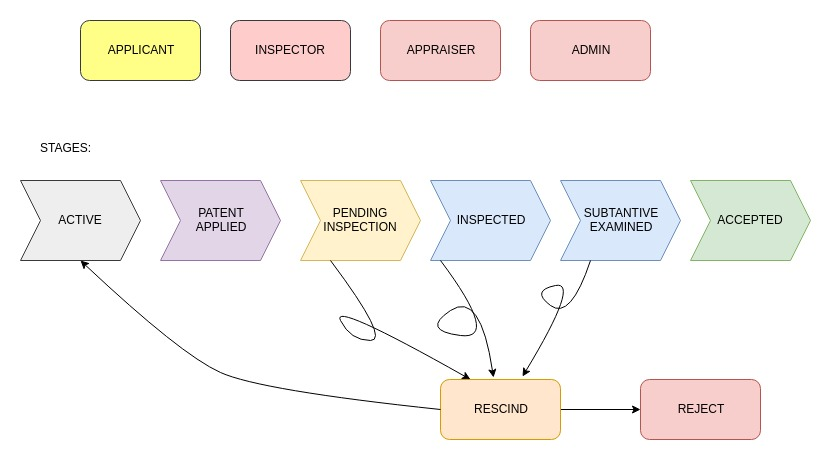

# Patent-lite-contract

This contract is deployed on Azure Blockchain Workbench.

## What is Azure Blockchain Workbench?
Azure Blockchain Workbench simplifies consortium blockchain network setup as a preconfigured solution with an Azure Resource Manager solution template. The template provides simplified deployment that deploys all components needed to run a consortium. Today, Blockchain Workbench currently supports <b> Ethereum</b>.

Azure Blockchain Workbench provides a web application and REST APIs for managing blockchain applications and users. Blockchain Workbench administrators can <b>manage application access</b> and assign your users to application roles. Azure AD users are automatically mapped to members in the application.

Configuration file - <code>Patent.json</code>:

Configuration metadata defines the high-level workflows and interaction model of the blockchain application. Configuration metadata represents the workflow stages and interaction model of the blockchain application.

Solidity Contract - <code>Patent1.sol</code>:

Smart contracts represent the business logic of the blockchain application. Currently, Blockchain Workbench supports Ethereum for the blockchain ledger. Ethereum uses Solidity as its programming language for writing self-enforcing business logic for smart contracts.

### Workflow of Contract:

Application Roles 
------------------

| Name       | Description                                                                                         |
|------------|-----------------------------------------------------------------------------------------------------|
| Applicant     | A person who applies for the patent.                                             |
| Admin      | Verifies at a high level and assigns Inspector and Appraiser to application.                                     |
| Inspector  | A person who is chosen by the admin to be the inspector of the patent being considered.   |
| Appraiser  | A person who is chosen by the admin to be the appraiser for the patent being considered.  |

States 
-------

| Name                 | Description                                                                                                 |
|----------------------|-------------------------------------------------------------------------------------------------------------|
| Active               | Indicates that an patent is available.                                                      |
| Patent Applied         | Indicates a patent application being accepted.                                                                       |
| Pending Inspection   | Indicates a aptent being assigned Inspector and Appraiser.                      |
| Inspected            | Indicates the Inspector's approval regarding patent under consideration.                                    |
| Appraised            | Indicates the Appraiser's approval regarding patent under consideration.                                    |
| Accepted             | Indicates that the inspector, approver and admin have agreed to the acceptance of the patent under consideration.  |
| Terminated           | Indicates disapproval to continue with patent application.                       |

As this is a permissioned blockchain, the participants are added into the application with roles specified prior to their participation in the blockchain. Only the admin can add other participants and specify their roles. Only the applicant can create an application for patent filing. After initialing the request, the admin accepts it and assigns relevant inspector and appraiser to the applicant for verification. Later the process goes ahead to inspection and subtantive examination. If either the inspector or the appraiser finds some changes to be made, they can rescind the applicaton specifying the corrections. This again leads the application to Active state and the process is repeated. At each point in time the user has the access to take back the application before it is accepted. All these transactions are recorded on the blockchain, making them immutable. This helps in providing proof for legal proceedings if such situation arises.
